<!-- ═══════════════════════════ HEADER ═══════════════════════════ -->


<br/>

<!-- ═══════════════════════════ SHOWCASE ═══════════════════════════ -->
<table>
<tr>
<td width="1000">
<div align="center">

<br/>

<sub><b>FEATURED PROJECT &nbsp;·&nbsp; ONKONIXAI</b></sub>

<h2><a href="https://github.com/tuncayorgundar/Nefes-AI---BronkoVision-Modulu">Nefes AI — BronkoVision</a></h2>

Deep learning–based **tumor detection & segmentation** on medical images,<br/>
built as Co-Founder & AI/ML Developer at **OnkoNixAi**.

<br/>

<table>
<tr>
<td align="center" width="230"><b>Detection</b><br/><sub>Locates suspicious regions</sub></td>
<td align="center" width="230"><b>Segmentation</b><br/><sub>Delineates tumor boundaries</sub></td>
<td align="center" width="230"><b>Clinical Support</b><br/><sub>Faster, consistent review</sub></td>
</tr>
</table>

<br/>


<a href="https://github.com/tuncayorgundar/Nefes-AI---BronkoVision-Modulu"></a>

<br/><br/>

</div>
</td>
</tr>
</table>

<div align="center">

<br/>


<a href="https://www.linkedin.com/in/tuncayorgundar/"></a>
<a href="mailto:tuncayorgundar@gmail.com"></a>


</div>

<br/>

<!-- ═══════════════════════════ OTHER PROJECTS ═══════════════════════════ -->
## Other Projects

<table>
<tr>
<td width="50%" valign="top">

#### [Fighter UAV — Otonom Kilitlenme](https://github.com/tuncayorgundar/Fighter-UAV---Otonom-Kilitlenme-ve-Kamikaze-Kontrol-Yazilimi)
Autonomous target lock-on and kamikaze control software for fighter UAVs — real-time detection & tracking. *(TEKNOFEST Savaşan İHA)*


</td>
<td width="50%" valign="top">

#### [Swarm UAV — Senkronizasyon](https://github.com/tuncayorgundar/Swarm-UAV-Senkronizasyon-ve-Gorev-Yonetimi)
Synchronization and mission management for UAV swarms. *(TEKNOFEST Sürü İHA — team captain)*


</td>
</tr>
<tr>
<td width="50%" valign="top">

#### [SkyLink — UAV Yer Kontrol](https://github.com/tuncayorgundar/SkyLink-UAV-Destek-ve-Yer-Kontrol-Sistemi)
UAV support and ground control station system.


</td>
<td width="50%" valign="top">

#### [AI Face Recognition Access System](https://github.com/tuncayorgundar/Yapay_Zeka_Destekli_Yuz_Tespiti_Giris_Cikis_Sistemi)
AI-powered face detection based entry/exit control system.


</td>
</tr>
<tr>
<td colspan="2" valign="top">

#### [AI Coffee Fortune App](https://github.com/tuncayorgundar/Yapay-Zeka-Destekli-Kahve-Fal-Analiz-Uygulamas-)
AI-powered coffee-cup image analysis mobile app.


</td>
</tr>
</table>

<!-- ═══════════════════════════ ABOUT ═══════════════════════════ -->
## 👋 About Me

```python
class Tuncay:
    name      = "Tuncay Bayır"
    education = "B.Sc. Computer Engineering @ Necmettin Erbakan University (2026)"
    role      = "Co-Founder & AI/ML Developer @ OnkoNixAi"
    focus     = ["Computer Vision", "Autonomous Systems", "Edge AI", "LLM Agents", "VLMs"]
    motto     = "Code. Break. Fix. Repeat."
    status    = "Open to AI/ML roles 🚀"
```

## 🏆 Highlights

- 🥇 **TEKNOFEST Finalist** — Onkolojide 3T · Sürü İHA 2025 *(captain)* · Savaşan İHA 2024
- 🚀 **ROKETSAN AI Hackathon** — document assistant · YOLO detection & tracking · sensor fusion & autonomy
- 📊 **Miuul Machine Learning Bootcamp** — certificate of achievement

<!-- ═══════════════════════════ TECH STACK ═══════════════════════════ -->
## 🛠️ Tech Stack

<p align="left">
  
</p>

<!-- ═══════════════════════════ STATS ═══════════════════════════ -->
## 📈 GitHub Stats

<div align="center">
  
  
  <br/>
  
</div>

<!-- ═══════════════════════════ FOOTER ═══════════════════════════ -->
<div align="center">

<br/>

*"İstikbal göklerdedir."* — Mustafa Kemal Atatürk
<br/>
<sub>(The future is in the skies.)</sub>


</div>
